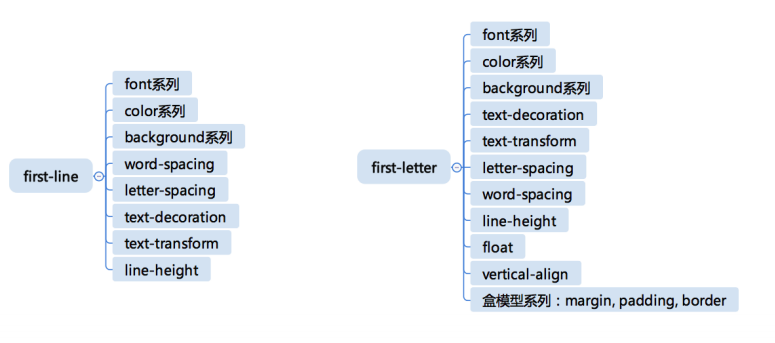

<!-- START doctoc generated TOC please keep comment here to allow auto update -->
<!-- DON'T EDIT THIS SECTION, INSTEAD RE-RUN doctoc TO UPDATE -->
**Table of Contents**  *generated with [DocToc](https://github.com/thlorenz/doctoc)*

- [CSS总论](#css总论)
- [CSS选择器](#css选择器)

<!-- END doctoc generated TOC please keep comment here to allow auto update -->

<!--
 * @Author: zhy
 * @Date: 2020-06-29 05:44:41
 * @LastEditTime: 2020-08-09 15:03:12
-->
#学习笔记

## CSS总论

1. CSS语法的研究
   > **2.1标准**——CSS总体结构：@charset,@import,rules(@media,@page,rule)
   - https://www.w3.org/TR/CSS21/grammar.html#q25.0
   - https://www.w3.org/TR/css-syntax-3/
  
2. CSS @规则的研究
   **at-rules**
   - @charset:https://www.w3.org/TR/css-syntax-3/ *声明CSS的字符集*
   - @import:https://www.w3.org/TR/css-cascade-4/ *级联规则*
   - **@media**:https://www.w3.org/TR/css3-conditional/ *查询媒体*
   - @page:https://www.w3.org/TR/css-page-3/ *分页媒体，打印机*
   - @counter-style:https://www.w3.org/TR/css-counter-styles-3/ *列表*
   - **@keyframes**:https://www.w3.org/TR/css-animations-1/ *定义动画*
   - **@fontface**:https://www.w3.org/TR/css-fonts-3/ *定义字体*
   - @supports:https://www.w3.org/TR/css3-conditional/ *兼容性检查*
   - @namespace:https://www.w3.org/TR/css-namespaces-3/
  
3. CSS规则的结构
   - 选择器(Selector: **level3:** https://www.w3.org/TR/selectors-3/ **level4:** https://www.w3.org/TR/selectors-4/)
   -     selector_group
   -     selector
         -     >
         -     <sp>
         -     +
         -     ~
   -     simple_selector
         -     type
         -     *
         -     .
         -     #
         -     []
         -     :
         -     ::
         -     :not()
   - 声明
   -     key
         -     Variables: https://www.w3.org/TR/css-variables/
         -     properties
   -     Value https://www.w3.org/TR/css-values-4/
         -     calc
         -     number
         -     length
         -     ……

4. 收集标准
   > https://www.w3.org/TR
   - **小实验：** JSON.stringify(Array.prototype.slice.call(document.querySelector('#container').children).filter(e => e.getAttribute('data-tag').match(/css/)).map(e => ({name:e.children[1].innerText, url:e.children[1].children[0].href})))
   - 爬虫工具：
   [css-crawler.js](./css-crawler.js)

5. CSS总论总结
   - CSS语法
   - at-rule
   - selector
   - variables
   - value
   - 实验

## CSS选择器

1. 选择器语法
   - 简单选择器
     - *
     - div svg|a (tagName)
     - .cls
     - #id
     - [attr=value]
     - :hover
     - ::before
   - 复合选择器
     - <简单选择器><简单选择器><简单选择器>
     -  div 或者 * 必须写在最前面
   - 复杂选择器
     -  <复合选择器><sp><复合选择器>    
     -  <复合选择器>">"<复合选择器> **父子选择器**
     -  <复合选择器>"~"<复合选择器> **邻接关系**
     -  <复合选择器>"+"<复合选择器> **邻接关系**
     -  <复合选择器>"||"<复合选择器> **选择表格中某一列**

2. 选择器的优先级
   - 简单选择器计数
     - 举例：#id div.a#id {...}
     - [0,2,1,1]
     - S = 0 * N³+ 2 * N²+ 1 * N¹+ 1
     - 取N = 1000000
     - S = 2000001000001

3. 伪类
   - **链接/行为**
     - :any-link (:any-link = :link :visited + :link)
     - :link :visited
     - :hover 
     - :active
     - :focus
     - :target
   - **树结构**
     - :empty 是否有子元素
     - :nth-child() 
     - :nth-last-child()
     - :first-child :last-child :only-child
   - **逻辑型**
     - :not伪类
     - :where :has

4. 伪元素
   - ::before
   - ::after
  ```
    <div>
        <::before/>
        content content content content
        content content content content
        content content content content
        content content content content
        content content content content
        content content content content
        <::after/>
    </div>
  ```
   - ::first-line
   - ::first-letter
   ```
    <div>
        <::first-letter>c</::first-letter> content content content content
        content content content content
        content content content content
        content content content content
        content content content content
        content content content content
    </div>
   ```
   ```
    <div>
        <::first-line>content content content content </::first-line>
        content content content content
        content content content content
        content content content content
        content content content content
        content content content content
    </div>
  ```
  - **可用属性**
  

  > **思考：**为什么 first-letter 可以设置 float 之类的，而 first-line 不行呢？
  > 参考：https://drafts.csswg.org/selectors-3/#first-line 
  答：first-letter 是在布局完成之后，确定一段文字中的第一个文字，可以对其操作布局时性能开销小；
    而 first-line 选中的是第一行文字，不同的宽度选中的文字内容不一样，要对其重新布局排版消耗性能大,甚至一些边缘情况里会有 BUG 出现。故 first-letter 可以设置 float 之类的，而 first-line 不行
  
  