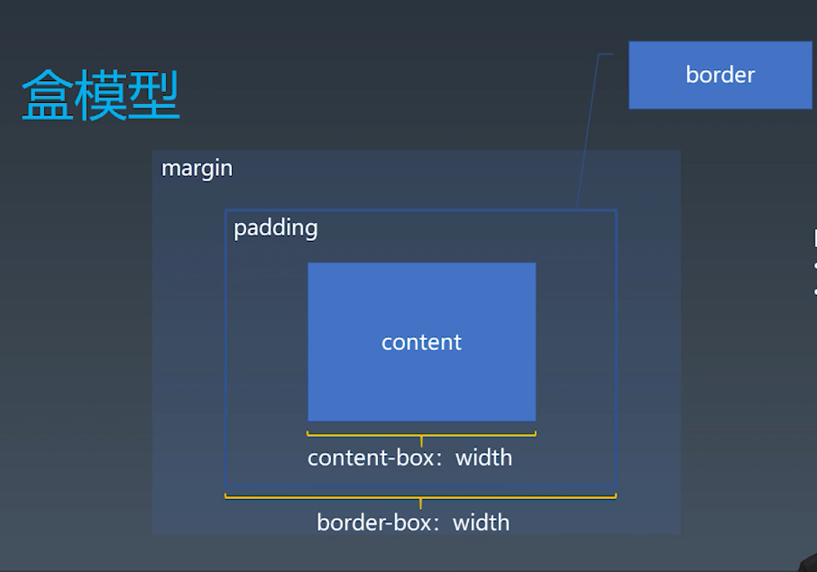

<!--
 * @Author: zhy
-->
# 学习笔记
## CSS排版
1. 盒（Box）
   
   |  源代码   | 语义  | 表现  |
   |  ----  | ------ | ----  |
   | 标签Tag | 元素Element | 盒Box |

   > - HTML代码中可以书写开始*标签*，结束*标签*和自封闭*标签*
   > - 一对起止*标签*，表示一个*元素*
   > - DOM树中存储的是*元素*和其他类型的节点（Node）
   > - CSS选择器选中的是*元素*
   > - CSS选择器选中的*元素*，在排版时可能产生多个*盒*
   > - 排版和渲染的基本单位是*盒*

   **盒模型**
   

2. 正常流
3. 正常流的行级排布
4. 正常流的块级排布
5. BFC合并
6. Flex排版

## CSS动画与绘制
1. 动画
2. 颜色
3. 绘制
   